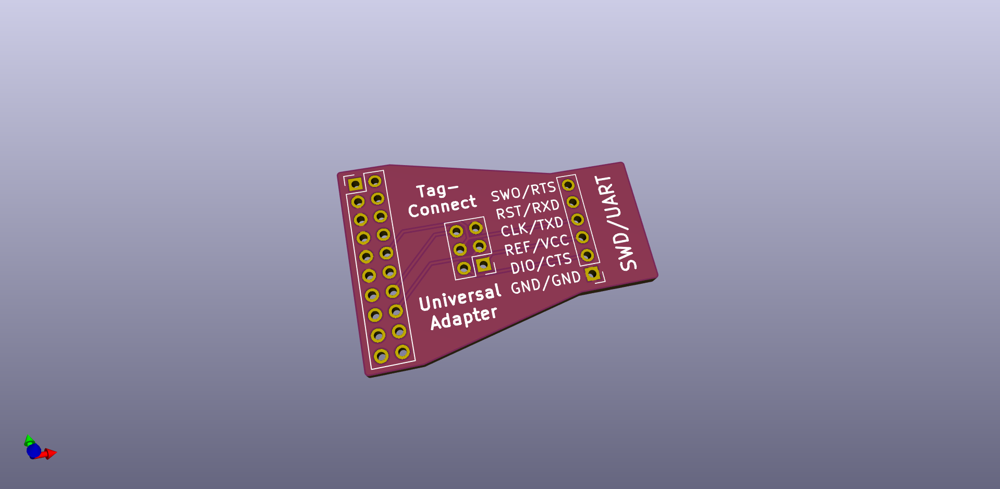
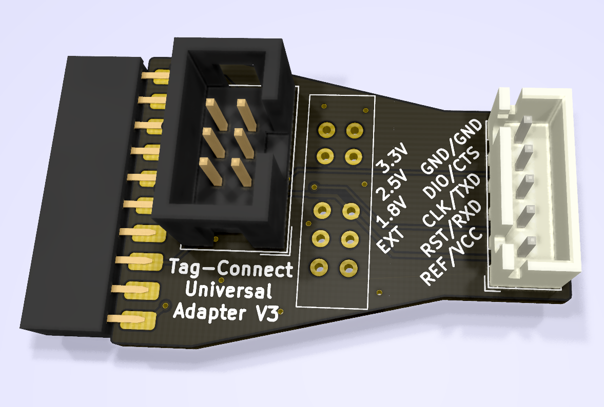

# JlinkBreakout

Segger Jlink to Tag-Connect/SWD breakout board.

## [V2](V2/)
Notes:
 - Use a right-angle 2 row, 20 position 0.1" (2.54mm) female header/socket
     + https://lcsc.com/product-detail/Pin-Header-Female-Header_Ckmtw-Shenzhen-Cankemeng-C124406_C124406.html

## [V3](V3/)
- Adds a voltage regulator with selectable output voltage (3.3V, 2.5V, 1.8V, External power)
- JST-XH connector for SWD
- 2x3 IDC Tag-connect header
- JTAG connector is standard 2 row, 20 position 0.1" (2.54mm) female header/socker, mounted on pcb edge
    + https://lcsc.com/product-detail/Pin-Header-Female-Header_BOOMELE-Boom-Precision-Elec-C30867_C30867.html
        * Pin thickness: 0.32mm to .064mm
        * Pin-pin clearance: 2.22mm to 1.9mm
    + Standard 1.6mm (0.062") PCB should be solderable, but there will be a gap, or 2mm (0.079") PCB would leave less clearance

